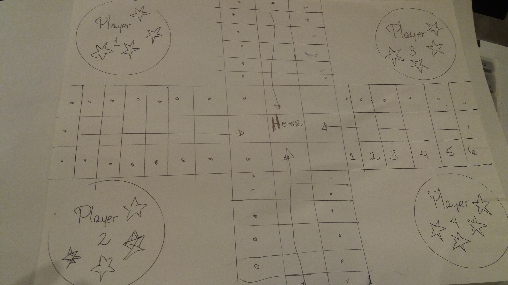
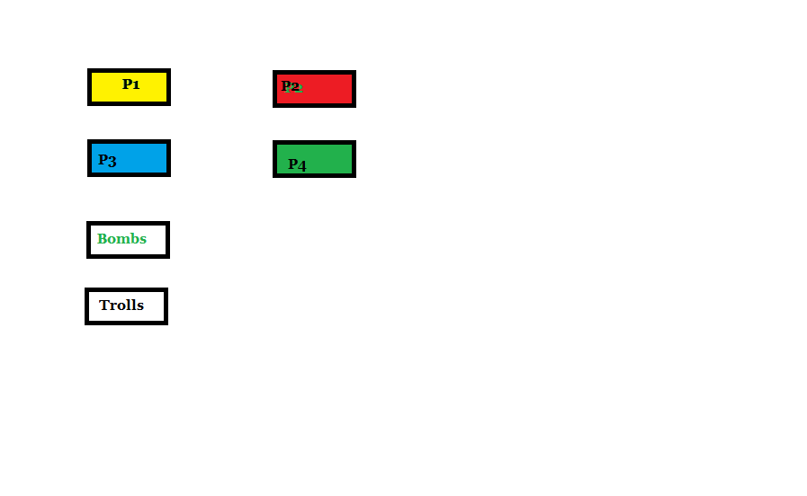

# Aury Rodriguez 07/12/2017<h1> 
## My game:parcheesi. <h2> 
##  What is parcheesi ? <h4>

## Parcheesi is a game that I used to play  when I was a child. It's an amazing family game, that everybody can have fun. Here are the rules.
* You need 2-4 players.
* Each player would have four pieces.
* Each player would be assigned a starting position on the board.
* Everybody would end at the same place(Center).
* Each player would have a chance to roll the dices, and the points they get are the positions they are moving on the board, but if they get the same number in the dice , they get another change.
* If they endup in a "jail" position, they lose the next turn.
* The player that gets the four pieces to the center place wins.

## Wireframe

## Challenges
* Desing the board
* Desing the dices
* Make the dices roll
* Make a cool miving image for the players
* Get who turn is depending of the position and the dices.

## Phases
* Wireframe the board
* Understand the logic of the game
* Pseudo-code
	-Logic for moving and positionig
	-Logic for getting an extra turn
	-Logic for skiping a turn
	-Logic for winnig
* HTML
	- Desing Board
	- Desing dices
	- Desing the pieces
	- Desing the players
* CSS
	- Style Board
	- Style dices
	- Style the pieces
	- Style the players
	- Animation for the dice to roll
	- Animation for the pieces to move
	- Animation for the player to move
* Functionality
	-Random players
	-Random points
	-Make the pieces move and stop
	-Check the turn
	-Winnig

